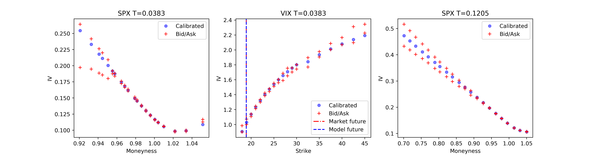
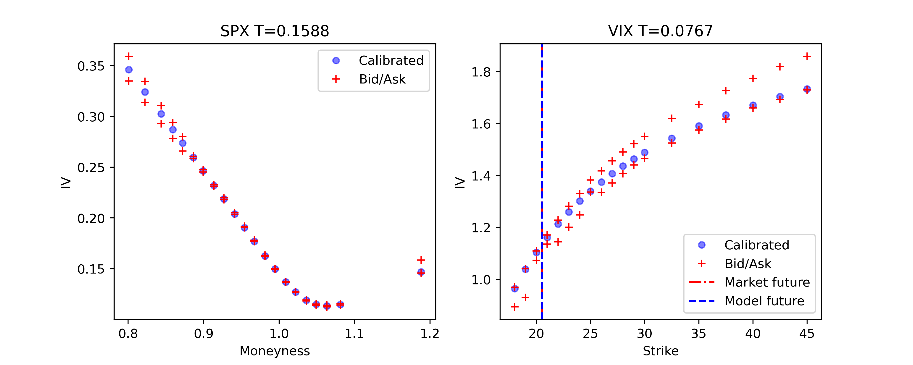
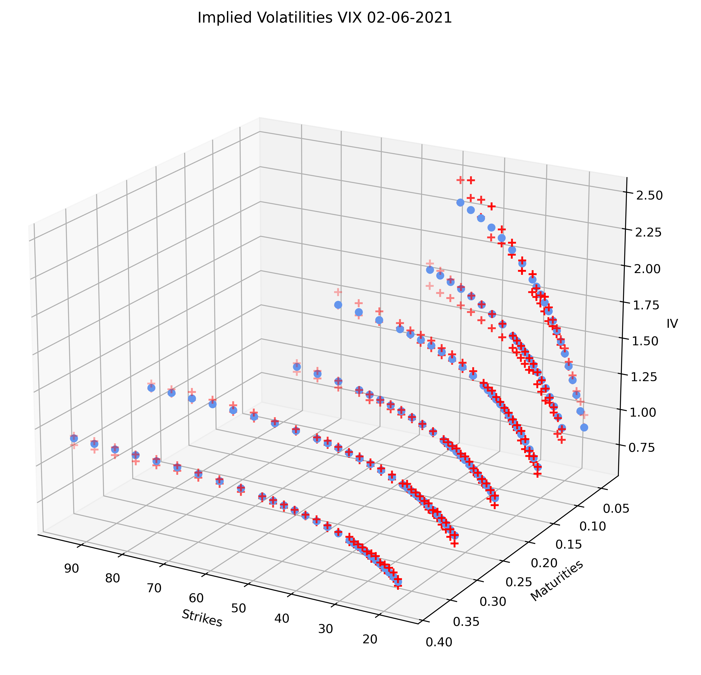

# jointcalib_sigsde

This is a collection of Python files which have been used in the article:<br><br> 
"Joint calibration to SPX and VIX options with signature-based models" <br><br>
of <a href ="https://www.mat.univie.ac.at/~cuchiero/">Christa Cuchiero</a>, <a href ="https://homepage.univie.ac.at/guido.gazzani/">Guido Gazzani</a>,  <a href ="https://quarimafi.univie.ac.at/about-us/janka-moeller/">Janka Möller</a> and <a href ="https://sites.google.com/view/sarasvaluto-ferro">Sara Svaluto-Ferro</a>.


For citations:\
**MDPI and ACS Style**\
Cuchiero, C.; Gazzani, G.; Möller J.; Svaluto-Ferro, S. <a href='https://arxiv.org/abs/2301.13235'>Joint calibration to SPX and VIX options with signature-based models</a>.
```
@article{CGMS:23,
  title={{Joint calibration to SPX and VIX options with signature-based model}},
  author={Cuchiero, C. and Gazzani, G. and M\"oller, J. and Svaluto-Ferro, S.},
  journal={Mathematical Finance},
pages={1–53},
  year={2024}
}
```
<br>

The codes that compose the present repository rely strongly on the theory outlined in the article in section 4, 5 and 6. In particular the use of the polynomial processes' theory for the computation of the conditional expected signature of a polynomial process. Recall that data were purchased from OptionMetrics and therefore are not present in the current repository. 

For an introduction to signature-based models in mathematical finance we address the reader to (forthcoming in SIAM Journal on Financial Mathematics):

Cuchiero, C.; Gazzani, G.; Svaluto-Ferro, S. <a href='https://arxiv.org/abs/2207.13136'>Signature-based models: theory and calibration</a>.
```

@article{CGS:22,
  author = {Cuchiero, C. and Gazzani, G. and Svaluto-Ferro, S.},
title = {Signature-Based Models: Theory and Calibration},
journal = {SIAM Journal on Financial Mathematics},
volume = {14},
number = {3},
pages = {910-957},
year = {2023}
}
```
We reference additionally to the Github repository  <a href='https://github.com/sarasvaluto/AffPolySig'> AffPolySig </a>, where a more general implementation of the expected signature of a polynomial process can be found. For details on the theory we refer to 

Cuchiero, C.; Svaluto-Ferro, S; Teichmann, J.   <a href='https://arxiv.org/abs/2302.01362'>Signature SDEs from an affine and polynomial perspective.</a>


<div class="about">
                <h2 style="color:#06386D"><b>Sampler for the log-price and the VIX squared</b></h2>
  <ul>
<li>Code for sampling: the Cholesky matrix for the VIX/VIX squared (see Remark 5.5)</li><br>
<li>Code for sampling: the log-price in particular the matrix Q^0 and the regression basis \tilde{e}^{B} (Proposition 6.5, Equation 6.3)</li><br>
        <li>For the VIX squared both numerical integration and exact simulation are reported see Remark 5.4 in the paper. </li><br>
  </ul>
  </div>
  Some comments on the sampler can be found in the paper.
  
  <div class="about">
                <h2 style="color:#06386D"><b>Joint calibration to SPX and VIX options with constant parameters</b></h2>
  <ul>
<li>Code for calibration to option prices of SPX and VIX options.</li><br>
  </ul>
  </div>
  Details of the calibration to option prices with signature-based models can be found in Section 7 of the paper.
 
  
  
  
  
  
<br>
  <br>
    <br>
  
  
  <br>
<br>
  <br>
  <br>
    <br>
  <br>
